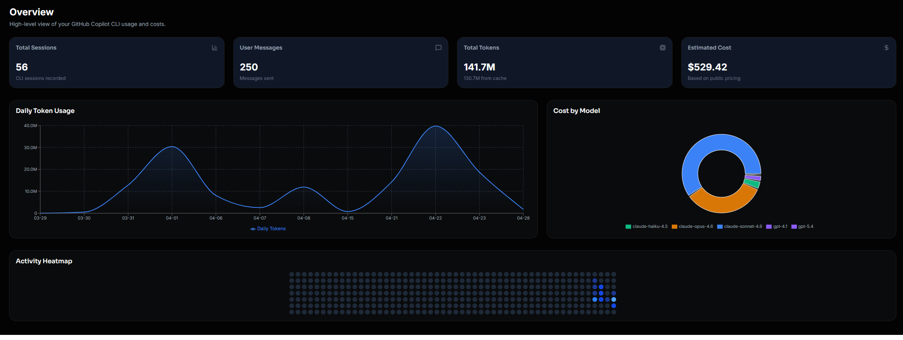
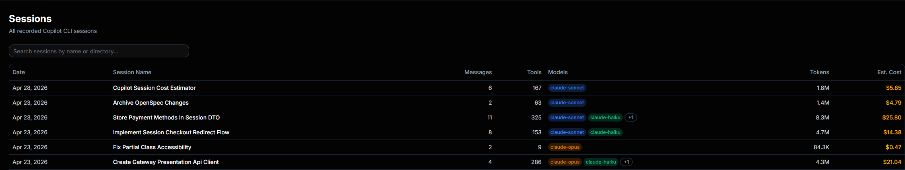
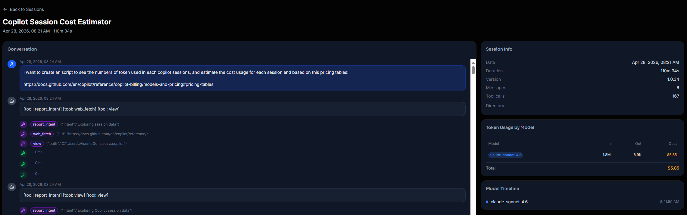
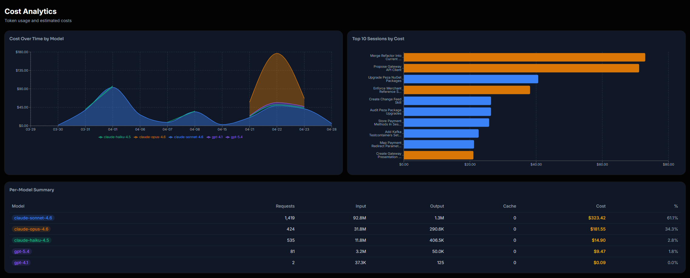

# Copilot Pricing Dashboard

<p align="center">
  <a href="https://github.com/vicentegnz/copilot-pricing-dashboard/blob/main/LICENSE">
    
  </a>
  <a href="https://github.com/vicentegnz/copilot-pricing-dashboard/commits/main">
    
  </a>
  <a href="https://github.com/vicentegnz/copilot-pricing-dashboard">
    
  </a>
  <a href="https://github.com/vicentegnz/copilot-pricing-dashboard">
    
  </a>
</p>

**Local-first analytics dashboard for GitHub Copilot.**

See exactly how many tokens you have used, which models you have talked to, what
each session cost, and how your usage trends over time -- all from your own
machine, no cloud, no telemetry.

This dashboard provides a detailed analysis of your GitHub Copilot usage,
helping you understand your consumption patterns and associated costs. By
running locally, it ensures that your data remains private and secure.

---

## Screenshots

### Overview

Stat cards, daily token usage area chart, cost-by-model donut, and a
GitHub-style activity heatmap — all at a glance.



---

### Sessions

Searchable table of every recorded Copilot CLI session with message count, tool
calls, models used, total tokens, and estimated cost.



---

### Session Detail

Full conversation replay with tool-call badges, per-model token breakdown, and a
model-switch timeline.



---

### Cost Analytics

Cost-over-time chart stacked by model, top-10 sessions by cost, and a full
per-model summary table.



---

## Features

| Page               | What you get                                                                                     |
| ------------------ | ------------------------------------------------------------------------------------------------ |
| **Overview**       | Stat cards, usage-over-time area chart, model cost donut, GitHub-style activity heatmap          |
| **Sessions**       | Searchable table of every session -- messages, tool calls, tokens, cost                          |
| **Session detail** | Full conversation replay with tool call badges, per-model token breakdown, model switch timeline |
| **Costs**          | Cost-over-time stacked by model, top-10 sessions bar chart, per-model cost table                 |

Data is read directly from `~/.copilot/session-state/` (or any path you
configure). Nothing leaves your machine.

---

## Quick Start

### Option A -- npm

```bash
git clone https://github.com/vicentegnz/copilot-pricing-dashboard.git
cd copilot-pricing-dashboard
npm install
npm run dev
```

Open **http://localhost:3000** to view the dashboard.

### Option B -- Docker

For Linux/macOS:

```bash
docker run -p 3000:3000 \
  -v ~/.copilot/session-state:/data/sessions:ro \
  ghcr.io/vicentegnz/copilot-pricing-dashboard
```

For Windows PowerShell:

```bash
docker run -p 3000:3000 `
  -v "$env:USERPROFILE\.copilot\session-state:/data/sessions:ro" `
  ghcr.io/vicentegnz/copilot-pricing-dashboard
```

### Option C -- Docker Compose

```bash
git clone https://github.com/vicentegnz/copilot-pricing-dashboard.git
cd copilot-pricing-dashboard
cp .env.example .env.local   # optional: override session path
docker compose up
```

Open **http://localhost:3000** to get started.

---

## Configuration

Copy `.env.example` to `.env.local` and set any variables you need:

```bash
cp .env.example .env.local
```

| Variable              | Default                    | Description                           |
| --------------------- | -------------------------- | ------------------------------------- |
| `COPILOT_SESSION_DIR` | `~/.copilot/session-state` | Path to your Copilot CLI session data |

> **Windows users:** use forward slashes in `.env.local`:  
> `COPILOT_SESSION_DIR=C:/Users/YourName/.copilot/session-state`

---

## How It Works

The dashboard reads data from the `events.jsonl` and `workspace.yaml` files
located in `~/.copilot/session-state/`.

```
~/.copilot/session-state/
+-- <session-uuid>/
    +-- events.jsonl     <- All events: messages, tool calls, model changes, etc.
    +-- workspace.yaml   <- Session metadata: name, cwd, timestamps
```

The API routes parse these files on the server-side with each request, returning
aggregated JSON to the client. The `session.shutdown` event provides
authoritative token counts for each model, which are used for cost estimation.

Costs are calculated based on the [GitHub Copilot pricing
table](https://docs.github.com/en/copilot/reference/copilot-billing/models-and-pricing)
(per 1 million tokens). Your plan's included AI credit allowance may cover some
or all of this usage.

---

## Contributing

Contributions are welcome! If you have ideas for improvements or new features,
feel free to open an issue or submit a pull request.

---

## License

This project is licensed under the MIT License. See the [LICENSE](LICENSE) file
for details.

## Build Docker image locally

```bash
docker build -t copilot-pricing-dashboard .
docker run -p 3000:3000 \
  -v ~/.copilot/session-state:/data/sessions:ro \
  copilot-pricing-dashboard
```

---

## Tech stack

- **[Next.js 15](https://nextjs.org)** -- App Router, Turbopack, standalone
  output
- **[TypeScript](https://www.typescriptlang.org)** -- fully typed throughout
- **[Tailwind CSS v4](https://tailwindcss.com) +
  [shadcn/ui](https://ui.shadcn.com)** -- dark-mode UI components
- **[Recharts](https://recharts.org)** -- area charts, donut, bar charts
- **[SWR](https://swr.vercel.app)** -- client-side data fetching with
  stale-while-revalidate

No database required. Reads session files directly via Node.js API routes.

---

## Contributing

PRs welcome! A few ideas for contribution:

- Date range filter on the sessions table
- Export data as CSV / JSON
- Token budget alerts
- Support for multiple data directories

```bash
git clone https://github.com/vicentegnz/copilot-pricing-dashboard.git
cd copilot-pricing-dashboard
npm install
npm run dev   # http://localhost:3000
```

---

## License

MIT
